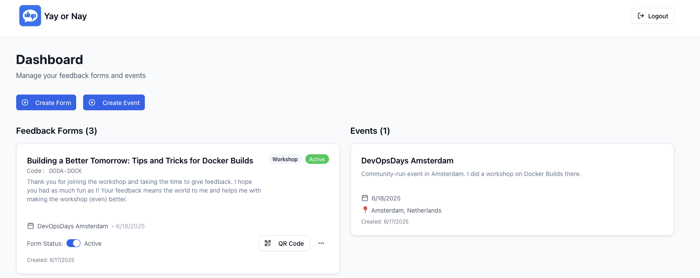
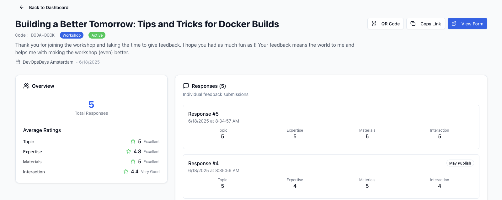
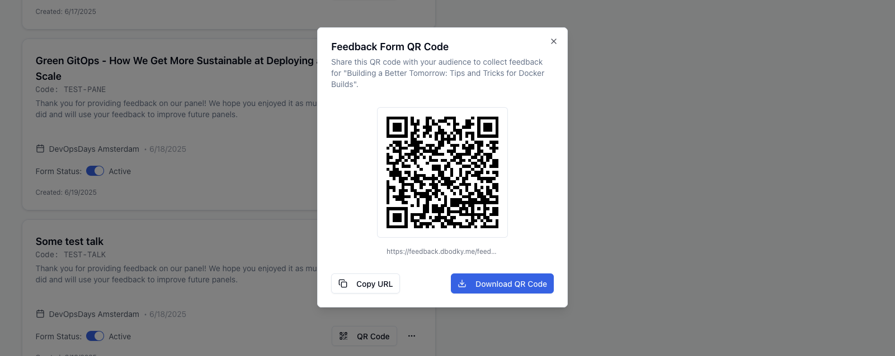
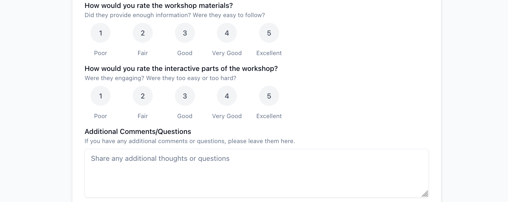

# Yay or Nay - An Opinionated Feedback App

Yay or Nay is a _small, selfhostable, and opinionated_ application for gathering feedback for public speakers.

It allows you to gather intel from attendees of your gigs, including

- **Talks/Presentations**
- **Workshops**
- **Panel Sessions**

You can find more information on Yay Or Nay, it's use-cases, and constraints,
[in the docs](https://docs.yay-or-nay.com).

Below are a few screenshots of the tool. There's also a [public demo](./README.md#public-demo) available.

## Screenshots

## Public Demo

There is a demo publicly available at [yay-or-nay.com](https://yay-or-nay.com/login), below are credentials
to log in:

| Credential | Value    |
| ---------- | -------- |
| Username   | `admin`    |
| Password   | `Adminpwd!` |

> [!NOTE]
> Data in the public demo gets deleted every 4 hours.

## Deploying Yay or Nay

You can deploy Yay or Nay on **Docker**, using the official Docker images at `ghcr.io/mocdaniel/yay-or-nay`.

In the future, there will be support for different deployment strategies, e.g. **Kubernetes**, as well as for
multiple **SaaS offerings** (Vercel, Netlify, etc.).

More information on how to deploy Yay or Nay can be found [in the docs](https://docs.yay-or-nay.com/getting-started/docker).

## Contributing

Feel free to contribute to this repository. More detailed information can be found in [`CONTRIBUTING.md`](./CONTRIBUTING.md).

> [!NOTE]
> Make sure to read the [`CONTRIBUTING.md`](./CONTRIBUTING.md) file, as well as the [What Yay or Nay Is and What it Isn't](https://docs.yay-or-nay.com/what-is-yay-or-nay) page of the docs.
>
> This is an opinionated project, and not all improvements and/or feature requests will get approved. If in doubt,
> feel free to [open an issue](https://github.com/mocdaniel/yay-or-nay/issues/new).

## License

This project is **MIT Licensed** and you may do with it (almost) whatever you want. A copy of the license is
distributed with this project's source code in [`LICENSE`](./LICENSE).

Additional information regarding used dependencies and their licenses can be found in [`NOTICE`](./NOTICE).

## Acknowledgements

Yay or Nay leverages frameworks, component libraries, and 3rd party libraries to do what it does:

- [NextJS](https://nextjs.org), the React Framework, as **framework**
- [shadcn-ui](https://ui.shadcn.com), an accessible component library, for **UI design**
- [TailwindCSS](https://tailwindcss.com), a utility-first CSS framework, for **styling**
- [React Hook Form](https://react-hook-form.com/), for **form state management**
- [Zod](https://zod.dev/), TypeScript-first schema validation, for **form validation**
- [LuciaAuth](https://lucia-auth.com/), where I vendored **auth and session code** from
- [Lucide](https://lucide.dev/), for **beautiful and consistent icons**
- [Bun](https://bun.sh), a fast all-in-one JavaScript toolkit, as **runtime**
